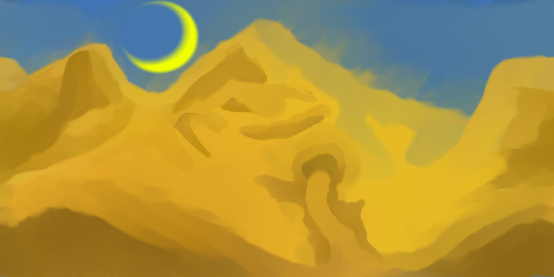

#  ~ ~ ~ Inside The Hourglass ~ ~ ~ 

## ! IMPORTANT INFORMATION ! 
1 - After the game has started and you're in the first level, click anywhere on the game canvas so it functions properly.
 
2 - The performance on different browsers may differ - all browsers have some level of sprite animation flickering,  except for Firefox which always displays the sprite images, but takes sometime to get them to move.

   

## What is this project?
This project was created by myself as the 1st Project for the Ironhack Full-Stack Web Development - Remote Bootcamp

   

## === Story ===
You play as Shel and make your way through a giant hourglass by running, jumping, shooting enemies with your bow and solving puzzles by controlling time. 

Time moves forward, backwards and stops - but what if the hourglass breaks?

#### Main Menu:
- "Start Game"           - Will start the game in Normal mode
- "Time Trial Mode"      - Will start the game and display a Timer on the top left
- "Highscores"           - Shows the Highscore board (currently session based and no possibility to save them)
- "Play My Other Games!" - Links to my itch.io page
- "Quit Game"            - Technically would quit the game, but you can just close the tab

  

## === Gameplay ===
You can only interact with items while time moves forward - items are influenced by time so you need to ensure you collect them at the right time. Enemies can be defeated while time is moving forward or stopped, so you can use the time to your advantage - but be careful as they respawn when rewinding the time!

#### Controls:
- A / <- | Move Left
- D / -> | Move Right
- Space  | Jump
- E      | Interact with items / doors
- F      | Shoot bow
- 1      | Stop / Rewind Time
- 3      | Stop / Resume Time

  
_________________________________________________________________________________________________

  

### === Game Structure in VS Project ===

#### === index.html ===
Handles the different screens for:
- Main Menu
- Highscore Menu
- Game Canvas

  

#### === styles/styles.css ===
Handles the layout for "index.html" and auto-hides the Highscore Menu and Game Canvas until activated

  

#### === scripts/classes.js ===
Contains the classes that are being defined for the game.

#### Classes:
- Player
- Enemies ("Lzard", "Spikes", "Boss")
- Items ("key", "roomtransit", "door")
- Environment (Walls, Floors, Elevators)
- Prompts (Tutorial Boxes, Story Texts)

  

#### === scripts/script.js ===
Defines the whole logic for the game inside the "window.onload ()" function, in order:

- Sets the visibility, style and actions for all the different HTML buttons
- Sets the animation arrays for the player and one of the enemies (the other ones are declared in the classes directly)
- Defines "startGame()" - actions for when the game start is triggered
- Defines "checkLevel()" - takes care of loading the relevant level objects and attributes
- Defines "levelXInit()" - loads all the different level objects and attributes when time comes
- "moveAllForNextLevel()" - moves away all the objects from the previous level when new level is loaded, as they are not removed from the game but stored for later
- "initializeAll()" - loads class sprites

- "checkStates()" - state machine that always defines the overall current setting for the game
--- Normal: Time moves forward
--- Stop: Time stops
--- Rewind: Time moves backwards
--- Levelrewind: Time moves back to beginning of level
--- Fullrewind: Time moves back to beginning of game
--- Roomtransit: When changing levels
--- Dead: When dead
--- Gamefinished: When the game has been completed
--- Endgame: When the game is ended by clicking "Return to Menu" button after dying

- "recordGame()" - ensures that each frame of each object is being stored in an array for the next function
- "rewindGame()" - moves back through the gameRec array to restore previous positions and states
- "restoreFromGameRec()" - called from "rewindGame()" that loops through the arrays
- "drawTimeControl()" - shows the time control image on the top of the game and changes it according to the current state
- "drawPlayer()" - takes care of displaying the player object and its sprites, as well as the movement logic
- "enableEnemies()" - same as "drawPlayer()", only for enemies
- "drawItems()" - same as "drawPlayer()", only for items
- "drawBackgroundAndEnvironment()" - same as "drawPlayer()", only for BG and Environment class tiles
- "animateSprite()" - general function that takes care of player and enemy sprite animations
- The following functions are timer- and highscore-related functions that take care of the Highscore logic